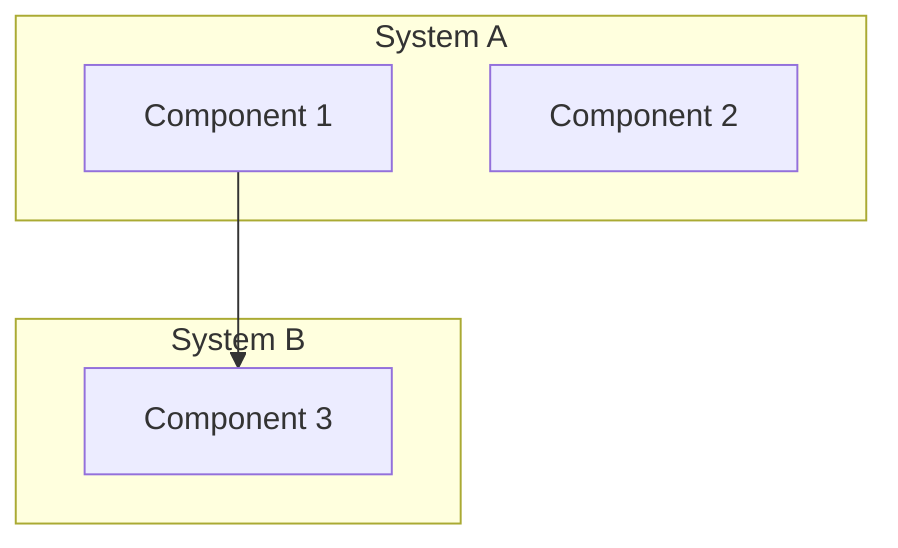

# Mermaid Integration Guide

## When to Use Mermaid vs CSS

| Condition | Use | Why |
|-----------|-----|-----|
| <7 nodes, no branching | CSS Pipeline | Mermaid renders too small for few nodes |
| 8-15 nodes | Mermaid | Auto-layout handles complexity |
| >15 nodes | Hybrid: Mermaid overview (5-8 nodes) + CSS Grid detail cards | Single diagram too dense |
| Sequence/timing | Mermaid sequenceDiagram | Timeline needs auto-layout |
| ER/Schema | Mermaid erDiagram | Relationship lines need auto-routing |
| State machine | Mermaid stateDiagram-v2 | State transitions need auto-layout |

Prefer `flowchart TD` (vertical). Use `LR` only for 3-4 node simple linear flows — LR compresses labels at 5+ nodes.

## CDN Setup

```html
<script type="module">
  import mermaid from 'https://cdn.jsdelivr.net/npm/mermaid@11/dist/mermaid.esm.min.mjs';

  const isDark = document.documentElement.classList.contains('theme-dark') ||
    window.matchMedia('(prefers-color-scheme: dark)').matches;

  mermaid.initialize({
    startOnLoad: true,
    theme: 'base',          // MUST be 'base' — never 'default' or 'dark'
    look: 'classic',
    themeVariables: {
      primaryColor: isDark ? '#134e4a' : '#ccfbf1',
      primaryBorderColor: isDark ? '#14b8a6' : '#0d9488',
      primaryTextColor: isDark ? '#f0fdfa' : '#134e4a',
      lineColor: isDark ? '#64748b' : '#94a3b8',
      fontSize: '16px',
      fontFamily: 'var(--font-body, system-ui)',
    }
  });
</script>
```

## Required CSS Overrides

```css
/* Node text must follow page theme */
.mermaid .nodeLabel { color: var(--text) !important; }
.mermaid .edgeLabel { color: var(--text-dim) !important; background-color: var(--bg) !important; }
.mermaid .edgeLabel rect { fill: var(--bg) !important; }
```

## Zoom Controls Container (MANDATORY)

Never use bare `<pre class="mermaid">` — diagrams render too small without zoom.

```html
<div class="mermaid-wrap">
  <div class="zoom-controls">
    <button type="button" data-action="zoom-in">+</button>
    <button type="button" data-action="zoom-out">&minus;</button>
    <button type="button" data-action="zoom-fit">&#8634;</button>
    <button type="button" data-action="zoom-one">1:1</button>
    <span class="zoom-label">100%</span>
  </div>
  <div class="mermaid-viewport">
    <pre class="mermaid">
      graph TD
        A[Input] --> B[Process]
        B --> C[Output]
    </pre>
  </div>
</div>
```

```css
.mermaid-wrap {
  position: relative;
  border: 1px solid var(--border);
  border-radius: 8px;
  overflow: hidden;
}
.zoom-controls {
  position: absolute;
  top: 8px;
  right: 8px;
  display: flex;
  gap: 4px;
  z-index: 10;
}
.zoom-controls button {
  width: 28px;
  height: 28px;
  border-radius: 4px;
  border: 1px solid var(--border);
  background: var(--surface);
  color: var(--text-dim);
  cursor: pointer;
  font-size: 14px;
}
.mermaid-viewport {
  overflow: auto;
  padding: 16px;
}
```

## autoFit (post-render, mandatory)

```javascript
function autoFitMermaid() {
  document.querySelectorAll('.mermaid svg').forEach(function(svg) {
    svg.removeAttribute('height');
    svg.style.width = '100%';
    svg.style.maxWidth = '100%';
    svg.style.height = 'auto';
    svg.parentElement.style.width = '100%';
  });
}
// Call AFTER mermaid renders, BEFORE SlideEngine init
```

## The 7 Gotchas

### 1. classDef: NEVER set `color:`

```mermaid
%% WRONG — hardcodes text color, breaks dark mode
classDef bad fill:#fefce8,color:#1a1a1a

%% RIGHT — use semi-transparent fill, let text inherit
classDef good fill:#b5761433,stroke:#b57614,stroke-width:2px
```

The `color:` property in classDef overrides `.nodeLabel` color and breaks the other theme. Use only `fill:` and `stroke:`.

### 2. Never use bare `<pre class="mermaid">`

Always wrap in `.mermaid-wrap` with zoom controls. Without zoom, diagrams with 5+ nodes are unreadable.

### 3. Prefer TD over LR

`flowchart TD` (top-down) gives nodes more horizontal space for labels. `LR` (left-right) compresses labels when you have 5+ nodes. Only use LR for 3-4 node simple linear flows.

### 4. Sequence diagrams: no special characters

`{}`, `[]`, `<>`, `&` in sequence diagram messages silently break the parser. Use plain text descriptions only:

```mermaid
%% WRONG
User->>Server: POST /api/{id}

%% RIGHT
User->>Server: POST api with id
```

### 5. Max 10-12 nodes per diagram

More than 12 nodes makes the diagram unreadable at slide size. Split into:
- Overview diagram (5-8 high-level nodes)
- Detail cards (CSS grid) for each node's internals

### 6. Never use native C4Context

Mermaid's C4Context diagram type ignores `themeVariables`. Use `graph TD` with `subgraph` blocks instead:



### 7. theme MUST be 'base'

Never use `theme: 'default'` or `theme: 'dark'` — they ignore `themeVariables` and produce inconsistent colors across light/dark modes. Always `theme: 'base'` + explicit `themeVariables`.

## CSS Pipeline (alternative for simple flows)

For <7 nodes with no branching, use CSS instead of Mermaid:

```html
<div class="pipeline">
  <div class="pipeline-step">
    <div class="step-num">1</div>
    <h3>Explore</h3>
    <p>Map every directory</p>
  </div>
  <div class="pipeline-arrow">&rarr;</div>
  <div class="pipeline-step">
    <div class="step-num">2</div>
    <h3>Analyze</h3>
    <p>Answer 5 questions</p>
  </div>
  <!-- more steps -->
</div>
```

```css
.pipeline {
  display: flex;
  align-items: stretch;
  gap: 8px;
}
.pipeline-step {
  flex: 1;
  background: var(--surface);
  border: 1px solid var(--border);
  border-top: 3px solid var(--accent);
  border-radius: 8px;
  padding: 16px;
  min-width: 0;
}
.pipeline-arrow {
  display: flex;
  align-items: center;
  color: var(--accent);
  font-size: 20px;
  flex-shrink: 0;
}
.step-num {
  font-family: var(--font-mono, monospace);
  font-size: 24px;
  font-weight: 700;
  color: var(--accent);
  opacity: 0.3;
  margin-bottom: 8px;
}
```

## Theme Switching

When the page theme toggles, Mermaid diagrams must re-render:

```javascript
function onThemeChange() {
  const isDark = document.documentElement.classList.contains('theme-dark');
  mermaid.initialize({
    theme: 'base',
    themeVariables: {
      primaryColor: isDark ? '#134e4a' : '#ccfbf1',
      primaryBorderColor: isDark ? '#14b8a6' : '#0d9488',
      primaryTextColor: isDark ? '#f0fdfa' : '#134e4a',
      lineColor: isDark ? '#64748b' : '#94a3b8',
    }
  });
  // Re-render all diagrams
  document.querySelectorAll('.mermaid[data-processed]').forEach(function(el) {
    el.removeAttribute('data-processed');
    el.innerHTML = el.getAttribute('data-original') || el.textContent;
  });
  mermaid.run();
}
```

Save original source on first render:
```javascript
document.querySelectorAll('.mermaid').forEach(function(el) {
  el.setAttribute('data-original', el.textContent.trim());
});
```
